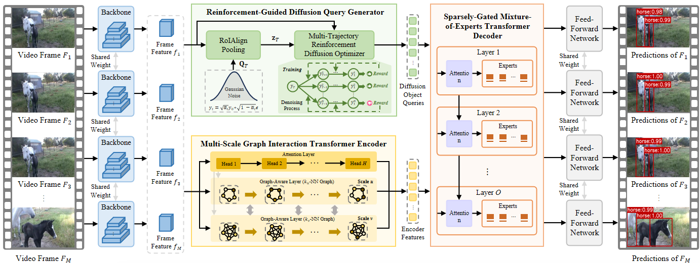

# M2TDiff: Multi-Scale MoE-Enhanced Transformer Diffusion Network for Video Object Detection

This repository is the official implementation of **M2TDiff**.

<div align="center">  </div>

## Abstract

Video object detection is a pivotal yet challenging
task in computer vision. In recent years, DETR-based methods
have gained prominence in this domain owing to their powerful
global modeling capability. However, these methods are usually
confronted with three crucial limitations: frame-agnostic object query initialization, scale-agnostic attention mechanism and
heterogeneity-agnostic feature transformation, which hinder their
capability to capture dynamic appearance variations and model
cross-frame temporal dependencies. To alleviate these limitations,
we propose a novel Multi-scale MoE-enhanced Transformer
Diffusion (M2TDiff) network for video object detection, including
three core technical improvements over existing methods. First,
we introduce a reinforcement-guided diffusion query generator,
which models the object query distribution through an iterative
diffusion process conditioned on the input frames and optimized
using a multi-trajectory reinforcement learning strategy, generating adaptive and content-aware object queries. Second, we design
a multi-scale graph interaction transformer encoder, which combines multi-head attention mechanisms with multi-scale dynamic
graph convolutions to learn scale-aware feature representations
while jointly modeling local and global contextual dependencies.
Third, we develop a sparsely-gated mixture-of-experts transformer decoder, which dynamically routes heterogeneous object
queries to specialized experts through sparse gating, enabling
query-specific representation learning. Furthermore, we present
two variants of M2TDiff, termed M2TDiff++ and M2TDiff-Fast,
which further improve detection accuracy by exploring more
diverse spatial-temporal cues and accelerate inference speed via
a differentiated keyframe/non-keyframe processing strategy. We
conduct experiments on the ImageNet VID and VisDrone-VID
datasets and the results show that M2TDiff achieves state-of-theart performance with a favorable accuracy-efficiency trade-off,
while its two variants further extend this frontier toward higher
accuracy and faster inference, respectively. Particularly, on the
ImageNet VID dataset, M2TDiff achieves 89.2% mAP at 45.2
FPS on a single 5090 GPU, M2TDiff++ reaches 94.1% mAP, and
M2TDiff-Fast obtains 88.5% mAP at 53.8 FPS.

## Main Results

|  Method |  Backbone  | Frame Numbers |  mAP@0.5 | ms/frame |
| :-----: | :--------: | :-----------: | :------: | :------: |
| M2TDiff | ResNet-101 |       30      | **89.2** |   22.1   |
| M2TDiff |  Swin-Base |       30      | **93.0** |   39.6   |

Reported on the ImageNet VID validation set with 4×RTX 5090 (batch size 4);
see [`M2TDiff_base_model.md`](M2TDiff_base_model.md) for details, VisDrone-VID
results, and the ablation study.

`ms/frame` and `FPS` are measured on the ImageNet VID validation set with
`batch_size=1` (reported by `tools/eval_m2tdiff.sh`).

## Updates

* (2026/08) M2TDiff source code released.

## Installation

The codebase is built on top of [Deformable DETR](https://github.com/fundamentalvision/Deformable-DETR).

### Requirements

* Linux, CUDA>=9.2, GCC>=5.4

* Python>=3.7

  We recommend using Anaconda to create a conda environment:

  ```bash
  conda create -n m2tdiff python=3.7 pip
  conda activate m2tdiff
  ```

* PyTorch>=1.5.1, torchvision>=0.6.1 (following instructions [here](https://pytorch.org/))

  ```bash
  conda install pytorch=1.5.1 torchvision=0.6.1 cudatoolkit=9.2 -c pytorch
  ```

* Other requirements

  ```bash
  pip install -r requirements.txt
  ```

* Build MultiScaleDeformableAttention

  ```bash
  cd ./models/ops
  sh ./make.sh
  ```

## Usage

### Dataset Preparation

M2TDiff is evaluated on two widely used video object detection benchmarks:
**ImageNet VID** and **VisDrone-VID**.

#### ImageNet VID

Download the ILSVRC2015 DET and ILSVRC2015 VID datasets from
[the official website](https://image-net.org/challenges/LSVRC/2015/2015-downloads),
and convert the annotations to JSON format using the
[MMTracking tools](https://github.com/open-mmlab/mmtracking/blob/master/tools/convert_datasets/ilsvrc/).

The expected directory structure is:

```text
code_root/
└── datasets/
    └── imagenet_vid/
        ├── Data/
        │   └── VID/
        │       ├── train/
        │       └── val/
        │
        └── annotations/
            ├── imagenet_vid_train.json
            └── imagenet_vid_val.json
```

#### VisDrone-VID

Download the VisDrone-VID dataset from the
[official VisDrone website](https://github.com/VisDrone/VisDrone-Dataset)
and organize the dataset according to the following structure:

```text
code_root/
└── datasets/
    └── visdrone_vid/
        ├── Data/
        │   └── sequences/
        │       ├── train/
        │       └── val/
        │
        └── annotations/
            ├── visdrone_vid_train.json
            └── visdrone_vid_val.json
```

After downloading and processing the datasets, make sure that the directory
structure matches the layouts shown above. We recommend using symbolic links
to place the datasets under the `datasets/` directory.


### Pretraining the Single-Frame Baseline

1. Download the COCO-pretrained weights from
   [Deformable DETR](https://github.com/fundamentalvision/Deformable-DETR) and
   put the checkpoint into:

```text
./exps/our_models/COCO_pretrained_model/
```

2. Train the single-frame baseline, which is used as the resume checkpoint
   of M2TDiff:

```bash
GPUS_PER_NODE=8 ./tools/run_dist_launch.sh $1 r101 $2 configs/r101_train_single.sh
```

### Training M2TDiff

Using the single-frame baseline weights (e.g.
`./exps/singlebaseline/r101/checkpoint0009.pth`, produced by the previous step)
as the resume model:

```bash
# single node, 8 GPUs
GPUS_PER_NODE=8 ./tools/run_dist_launch.sh $1 r101 $2 configs/r101_train_m2tdiff.sh

# or directly (single GPU)
sh configs/r101_train_m2tdiff.sh
```

All RDQG, MGTE, and SMTD hyperparameters are exposed as `main.py` flags;
see `configs/r101_train_m2tdiff.sh` for the recommended values.

### Evaluation

```bash
# Evaluate the M2TDiff checkpoint
# Writes eval_<dataset>.json with mAP@0.5, ms/frame, and FPS
./tools/eval_m2tdiff.sh exps/m2tdiff/r101_m2tdiff checkpoint.pth
```

To evaluate an ablation variant, disable components with `0/1` environment
variables:

```bash
USE_RDQG=0 USE_MGTE=0 USE_SMTD=0 ./tools/eval_m2tdiff.sh exps/m2tdiff/r101_A0_baseline
```

### Ablation Matrix & Hyperparameter Scan

```bash
# A0~A6 ablation matrix (train + evaluate each variant; A0 is the baseline anchor)
EPOCHS=15 ./tools/ablation.sh
EPOCHS=50 ./tools/ablation.sh

# Run a single experiment
./tools/ablation.sh A6

# Single-variable scan over T / K / knn / L / Y / M
SCAN=T   ./tools/scan.sh               # diffusion steps T in {2,4,6}
SCAN=K   ./tools/scan.sh               # trajectories K in {1,3,5,7}
SCAN=knn ./tools/scan.sh               # knn_k in {1,10,11,21}
SCAN=L   ./tools/scan.sh               # graph layers L in {1,2,3}
SCAN=Y   ./tools/scan.sh               # experts Y in {2,4,8}
SCAN=M   ./tools/scan.sh               # window M in {10,20,30}

# Aggregate every eval_*.json into a Markdown table
python tools/parse_logs.py exps/m2tdiff --out docs/experiments.md
```

## Acknowledgement

This project is developed based on the following project. We thank the authors
for releasing their code:

* [Deformable DETR](https://github.com/fundamentalvision/Deformable-DETR)

## Citing

If you find this work useful in your research, please consider citing:

```bibtex
@inproceedings{qi2025tgbformer,
  title={TGBFormer: Transformer-graphformer blender network for video object detection},
  author={Qi, Qiang and Wang, Xiao},
  booktitle={Proceedings of the AAAI Conference on Artificial Intelligence},
  volume={39},
  number={6},
  pages={6559--6567},
  year={2025}
}
```

And the base work:

```bibtex
@inproceedings{qi2026mstdiff,
  title={MSTDiff: Multiscale-Aware Transformer Diffusion Network for Video Object Detection},
  author={Qi, Qiang and Shang, Wenqi and Wang, Xiao and Liang, Yanjie and Lin, Shuyuan},
  booktitle={Proceedings of the AAAI Conference on Artificial Intelligence},
  volume={40},
  number={10},
  pages={8475--8483},
  year={2026}
}
```
